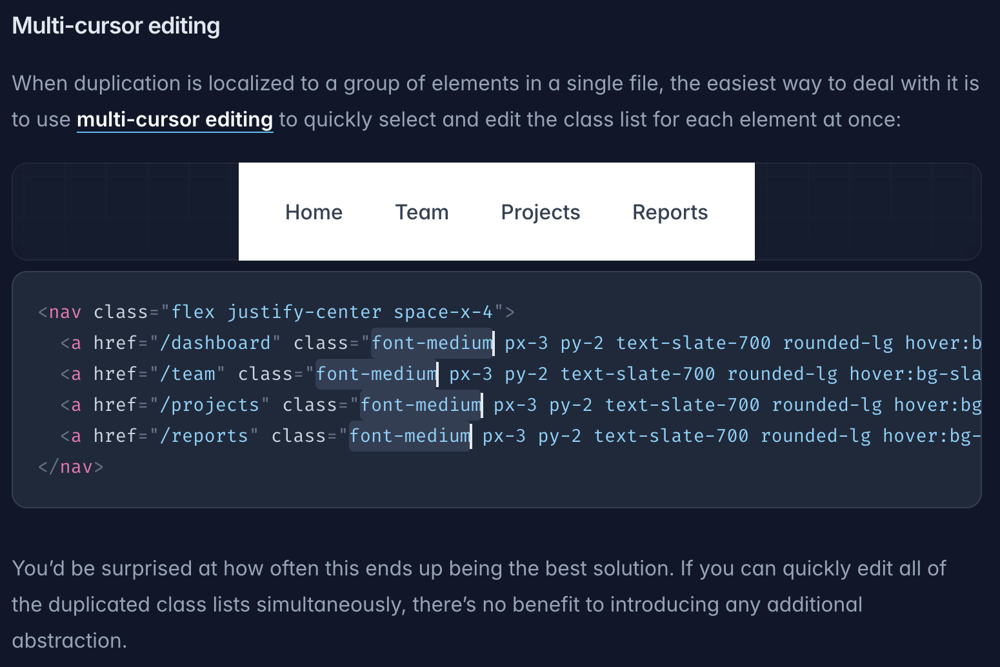


Tailwind is the worst of all worlds. It is a regrettable step backwards that takes everything bad about CSS and modern web development and brings it all together in one library.

## CSS's Successes and Failures

Of all the web technologies that underlie the modern web, the one that has received the fewest fundamental changes is CSS. We've gotten amazing things like flexbox, grid, container queries, and more which have supercharged the ability to quickly build responsive styles. While we're far from the days of using tables for layout and googling "how to vertically center css" once a week, the language semantics themselves hasn't had to change much. This is because CSS offers two well rounded ways of applying styles that work pretty well: inline styles and stylesheets.

Inline styles let you quickly add targeted rules to a single element. Much maligned historically due to the fact that many abused them and thus failed to keep their code DRY, there's really nothing wrong with inline styles. If there **is** something wrong with them, it's simply that an HTML attribute is a kind of clunky place to write out styles. They'll wander off screen on your editor once you have enough rules and it's harder to get nice formatting or static analysis. But if you're a good developer you won't use inline styles this way very often. (This is what we call foreshadowing).

Stylesheets are the much more powerful feature. They let you assign a set of rules to zero, one, or many elements at once with the minimum amount of code. They also include all the fancy features like media queries, container queries, and pseudo-elements, which are not available inline. Flaws that existed in the early days of stylesheets have largely been remedied, albeit not always in the most desirable way. SCSS variables had broader support (since they simply compiled to basic CSS) and were prettier than CSS variables, but eventually SCSS started losing steam in the face of an improving CSS.

CSS definitely isn't perfect. Like JavaScript's `==` operator, some ideas were bad then and are still bad now. CSS chooses which styles overwrite others based on selector specificity, leading some style debugging to be a bit of a rat's nest where the developer ends up bailing out to `!important` tags, which just kick the can down the road. Worse yet, when two rules have the same specificity, the default functionality is to pick whichever is defined last in the *stylesheet*. So, in this example, the styles of `two` win out over `one`, because the `.two` rule is declared after the `.one` rule, even though the `one` class comes second on the div.

```html
<style>
.one {
	text: red
}
.two {
	text: blue
}
</style>
<div class="two one"></div>
```

With modern multi-sheet websites and bundlers, this can get confusing fast as it can be hard to keep track of which sheet was loaded first on every page.

Additionally, CSS's status as a separate language from JavaScript is a blessing and a curse. It's a blessing in that CSS can be downloaded, parsed, and rendered in parallel extremely quickly by modern browsers, sidestepping the single-threadedness of JavaScript. But a curse in that modern apps simply require some amount of JavaScript-CSS interop since CSS is not a general purpose language. Sharing variables to keep styles consistent betweent he two means duplicating code between the two languages.

Much of these problems are solved with modern tooling, albeit often with their own caveats. Tools like [styled-components](https://styled-components.com/) brought JS and CSS together fairly seamlessly, giving you all the power of JavaScript (functions, etc) in your CSS. The caveat is that styles are compiled into Javascript (slow, single threaded) rather than CSS (fast, parallel). Tools like [vanilla-extract](https://vanilla-extract.style/) have done an admirable job giving you fully typed CSS-in-JS-in-CSS, compiling JS created styles into CSS files. Lastly, tools like React have made inline styling much better with objects that are linter, type system, and formatter friendly.

## Okay, now can we dunk on Tailwind?

For reasons we'll get into later, Tailwind decided to burst on to the scene and become the default styling solution for all modern web development despite taking each and every one of these problems, exacerbating them, and applying them to places that didn't have them before. Lets see how Tailwind replicates CSS's main paradigms. Remember, inline styles let you control single element styles simply and fairly explicitly: `style="background: red; color: blue;"`. Classes let you control multi-element styles simply, with the slight annoyance that it's easy to misspell your class name and spend way too long debugging before realizing it: `class="todo-item"`.


Tailwind exclusively offers inline styles via classes. Classes are single strings separated by spaces, not key-value pairs. So the classes must be something like `class="bg-red txt-blue"`. Key and value must be obscured into a plain string, lowering readability and writability. If you misspell one of these plain strings your editor is not going to tell you. You'll just have to find out once you get into the browser. Did you notice that `txt-blue` is wrong, and it should actually be `text-blue`? No? Get used to it, you'll make that mistake daily because Tailwind is inconsistent in how it names things.

## Rule sets

What about applying a set of rules to multiple elements, as you do in style sheets with class rule sets, what does Tailwind offer for that?

Nothing. The answer is nothing. Tailwind's official recommendation for this is to ignore everything you've ever learned about constants and duplicate your class names. Then simply remember to always use multi-cursor editing any time you touch them:



You can, of course, disobey the Tailwind overlords and create constants or components, but those solutions end up clunky because you are dealing purely with strings instead of objects. An element with a mere 10 CSS rules, will inevitably wrap in your editor and be more difficult to read and extend than a simple object would be:

```jsx
const sharedClass = `mx-auto max-w-md overflow-hidden rounded-xl bg-white shadow-md text-black border border-black border-solid`;
return <div className={
	clsx(sharedClass, {'display-none': !visible})
}></div>
```

vs.

```jsx
const sharedInline = {
	marginLeft: 'auto',
	marginRight: 'auto',
	maxWidth: MEDIUM_WIDTH,
	overflow: 'hidden',
	borderRadius: EXTRA_LARGE_ROUNDED,
	background: 'white',
	boxShadow: MEDIUM_BOX_SHADOW,
	color: 'black',
	border: '1px solid black',
};
return <div styles={{
	...sharedInline, display: visible ? 'block' : 'none'
}}></div>
````

## CSS's Problems are Tailwind's Problems

Tailwind offers no solution to the built in problems of CSS. Tailwind classes are generated dynamically outside of your purview by the bundler and thus make it even harder to understand who will win a specificity conflict. For example:

```jsx
<div className={clsx('text-red bg-blue', {
	'text-blue bg-red': currentPage === activePage
})}></div>
```

This seems straightforward. Red when inactive, blue when active, right? Nope. Which class comes first in the generated stylesheet is not predictable. Tailwind's recommendation is to, once again, ignore basic coding principles and recommend you duplicate your business logic:

```jsx
<div className={clsx('text-sm', {
	'text-red bg-blue': currentPage !== activePage
	'text-blue bg-red': currentPage === activePage
})}></div>
```

As a result, tailwind developers fall back on the same trick as the CSS developers of yore: spamming important tags (in the form of `!` suffixes on their class names) every time things don't work out nicely.

## Did you really say bundler?

Yes. Despite offering no real solutions to CSS's problems and instead making them worse, Tailwind requires a plugin and a bundler to function. It can not be simply dropped into a plain web page. This bundler is doing code processing so basic it's almost admirable. It simply searches all your files and looks for things that look like Tailwind classes, and then it makes a CSS class rule set for each one.

The oft-touted benefit of this system is that Tailwind will minimize your bundle sizes by only including what you need. Unfortunately this benefit does not hold up to basic scrutiny on medium-to-large codebases. By the time your codebase gets big enough to actually worry about how much CSS you have, you will have one class for every individual possible CSS rule you'll ever use. Still, this isn't much of a problem since CSS loads in parallel and it loads fast.

The problem is what it does to your *JavaScript bundle sizes*. Tailwind expects you to define styles via several classes on basically every element in your codebase. Meaning every time you use it you are writing out long strings which increase your slow, single-threaded, fully blocking JavaScript bundle size. Consider the following simple example with plain CSS:

```css
.todo-item {
	color: var(--warning-color);
	background: blue;
}
```

```jsx
<div className='todo'>1</div>
<div className='todo'>2</div>
<div className='todo'>3</div>
```

And this one with tailwind:
```css
// CSS (Generated by Tailwind)
.text-warning {
	color: #ffcc00;
}
bg-blue: {
	background: blue;
}
```

```jsx
<div className='text-warning bg-blue'>1</div>
<div className='text-warning bg-blue'>2</div>
<div className='text-warning bg-blue'>3</div>
```

In this simple but common example, tailwind generates a larger CSS bundle *and* a larger JS bundle! Lets give Tailwind the benefit of the doubt and say the codebase designed around the first style, with plain CSS classes, is going to end up with more CSS due to the same rules being duplicated across different selectors. That `color: var(--warning-color)` rule may be repeated hundreds of times in a mature codebase. This will generate more CSS. But *that's just fine*.

CSS bundle size matters an order of magnitude less than JavaScript bundle size. On the React projects that Tailwind is typical on you will be writing your CSS in `className` attributes. That means hundreds of repeats the string `txt-warning` strewn about your JSX files. This is increasing your *Javascript* bundle size, halting your entire app while that larger file is downloaded, parsed, and run.

## Developer Friendliness

Tailwind does nothing to reduce the mental load on your developers to understand, read, and write in your codebase. In fact it does the opposite. Your developers are not spared the hassle of learning CSS by instead learning tailwind's abstractions. Developers have to understand not just that `background-color` is the CSS key to set a background color, but they also must understand that classes prefixed with `bg-` mean background color. Every feature of CSS, such as media and container queries, will need to be learned twice, CSS style and Tailwind style.

Tailwind offers no type safety and little in the way of developer tooling outside of editor extensions that let you hover over a class to see the actual CSS that it translates to. Writing code with Tailwind means constantly hovering your cursor over class names and waiting a moment to see that your class translates to `align-items: center`. And when no hover comes up you know you mistyped (or your VSCode extension crashed) and now you have to Google "tailwind flexbox align items center" to remember it's not `align-items-center` or even `align-center`, it's `items-center`. All problems in tailwind must be solved this way.

When Tailwind does a major version update, it will sometimes rework its class names a bit. Every time this happens you need to use the codemods that Tailwind distributes with each update. These can only do so much to understand your codebase and realize what is a tailwind class and what is a plain string so you have to review every one of the thousands of changes carefully. This is entirely a manufactured problem for Tailwind. When other libraries change APIs they can make the process straightforward through type systems, deprecation warnings, and clear error messages because they did not decide to base their entire library on parsing arbitrary strings.

## But what about using media queries inline?

One decent thing about Tailwind is the relative ease with which CSS's "stylesheet only" features can be accessed inline. For example you can set up a CSS rule that only applies to an element on large screens with the simple matter of prefixing that class with `lg:`. This is something that is annoying to do in raw CSS. However, every other CSS-in-JS tool I've used also offers a convenient way to do the same. More importantly, those solutions scale better. If you have five rules that should be different on large screens, you must write `lg:` five times and hover each one to make sure it's working. In a tool like [vanilla-extract](https://vanilla-extract.style/) you would define one type checked media query with all your type checked rules underneath.

There are some things that Tailwind simply can not do and in this case developers simply fall back to plain CSS or inline styles with JavaScript. Meaning that, once again, the mental load of understanding the codebase is increased. You need to understand not only that you might be reading tailwind classes or plaain CSS classes and you'll need to track down where those are in your stylesheets when you do.

Do you see what I mean when I say the worst of all worlds?

## So what's the best of all worlds?

I like [vanilla-extract](https://vanilla-extract.style/). It's a fairly light type safe abstraction that gives you CSS in JS in just about the best way. It's not the best of all worlds but it's great at almost everything. I also don't mind writing apps with plain CSS, though this has problems as it can get hard to keep track of which styles are applying to what. I've also written decently sized apps purely using inline styles in React with some basic constants and it works pretty well, though that too has problems like the lack of media queries and increasing JS bundle size. My point here isn't to say that there is a best of all worlds. My point is to say that Tailwind is the worst of all worlds.

## Okay, so why does everyone use tailwind if it's the worst of all worlds?

I think the most important factor in Tailwind's success is that it does one thing very correctly: it demands the developer who installs it set up a config file that lays out all codebase-wide style constants: colors, margin sizes, fonts, border radii, etc. Writing individual styles that do not use a pre-configured constant from the config file is clunky in Tailwind. This is a good thing, an unironic win for Tailwind. More than anything else, this is what a large codebase with multiple frontend devs needs: a rigid set of global constants that everyone is strongly incentivized to use.

I believe this is where Tailwind has succeeded and other libraries have struggled. Libraries like [vanilla-extract](https://vanilla-extract.style/) are legitimately great. But when I set up vanilla-extract in a new codebase I have to set up my own structure for global constants and make sure everyone is importing from that. For me, this works: I like to set up my own structure. I like having Javascript available in those files, for example to generate colors by inverting or tinting other colors. But creating this kind of structure requires foresight and discipline to do it right and ensure it is followed. You must write docs and every developer must read and understand them.

Since Tailwind has a single magical config file that instantly makes all items inside it globally available, the documentation of how constants work is outsourced to the tailwind docs. Questions of "why do we structure our constants this way?" can be answered simply: that's just how Tailwind works. There's no room to bicker about little things, the way we all used to quarrel about where the line breaks should be before prettier came along and let us defer that decision making to the tool. This is great. I like that I no longer format JS manually and I like that I rarely see one-time-use colors in tailwind.

Most companies adopting Tailwind do so because it offers an out of the box solution for a lack of standards and consistent colors. I think there are better libraries than Tailwind. Libraries that lead to smaller file sizes and better consistency. But to succeed some of these libraries may need to start being more authoritative. I love that vanilla-extract lets me do my own thing, but providing an easy to use default structure, that can be replaced if desired, would help adoption.

Lastly, Tailwind has also been buoyed by being by being the default styling that just about any LLM or vibe coding tool will produce unless it is explicitly asked not to. This feels like both uncharted and charted territory. Plenty of developers started using jQuery because the first StackOverflow result in their search explained how to solve that problem with jQuery.

But today we have a much larger set of decisions about codebase design being made all at once by a single tool. Developers who outsource these crucial decisions to LLMs are going to keep getting the worst of all worlds once the codebase becomes to unwieldy for vibes and needs actual developers.


